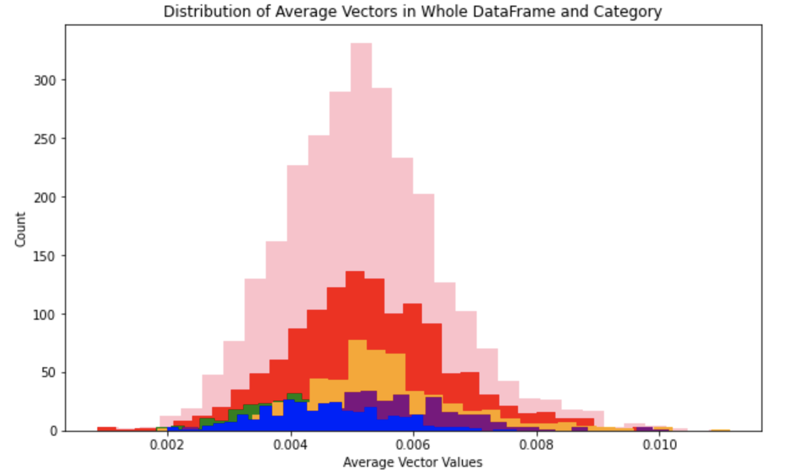
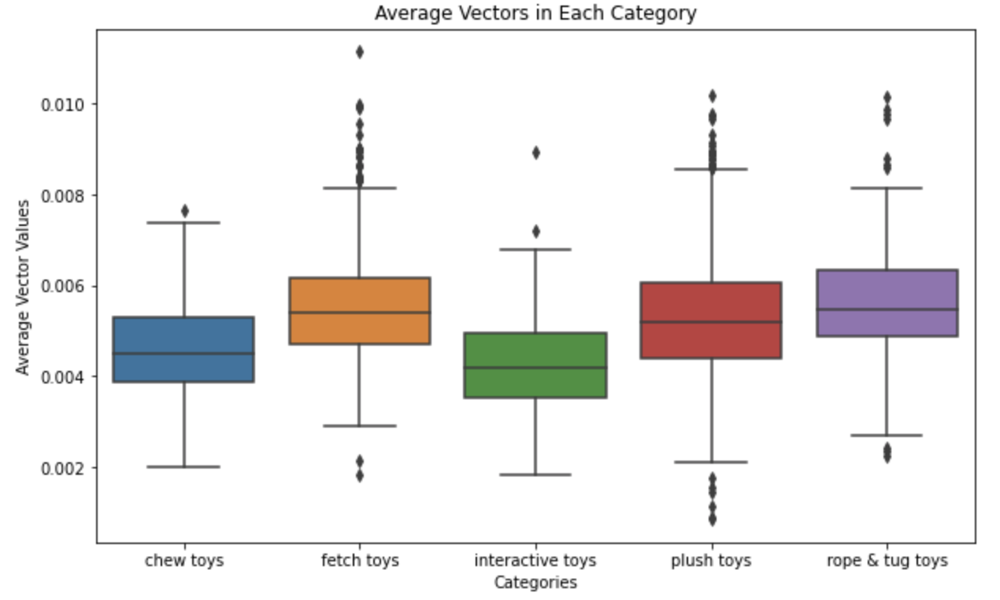

# General Assembly Capstone Project: Dog Toy Recommendation System
This is my final capstone project from the Data Science Immersive Bootcamp at General Assembly

## Table of Contents:
- Project Directory 
- Problem Statement
- Executive Summary 
- Conclusions and Recommendations

## Project Directory 
├── 00-capstone-checkin2.ipynb
├── 01-data-collection.ipynb
├── 02-data-cleaning-eda.ipynb
├── 03spacy-testing.ipynb
├── README.md
├── data
│   ├── chewtoy_df.csv
│   ├── chewy.csv
│   ├── fetchtoy_df.csv
│   ├── interactivetoy_df.csv
│   ├── plushtoy_df.csv
│   └── ropetugtoy_df.csv
├── images
│   ├── vect-cat-box.png
│   └── vect-cat-hist.png
└── recommender_app.py

## Problem Statement  
Based off the reviews, descriptions and key benefits of dog toys, and a person's description of their dog's general personality, I will create a recommendation system that will suggest ten dog toys that the dog might enjoy based off the similarity in what was written and the text provided about each toy. 

## Executive Summary    
**Data Collection** 
 - Using Selenium and BeautifulSoup, scraped dog toys from [Chewy.com](https://www.chewy.com) The categories of toys I scraped are chew toys, plush toys, fetch toys, interactive toys and rope and tug toys. 
 - The features that I scraped include: title, price, overall rating, description, key benefits (if this section exists), and reviews as well as the link to the toy's webpage. 
 - This process was definitely the greatest challenge due to overloading the website and computer capacity. I had to make sure to take it step by step in order to ensure that I did not overwhelm Chewy as well as my computer. 
 - Cleaned unneccessary characters from each column. For example, the "\$" in the price and some html characters that got collected in the scraping process by accident. 
 - Since I scraped toys by each category, I had to combine them all into one large dataframe to use. 

**Preprocessing & EDA**  
Preprocessing:
 - I created a new column, combining the text from the toys' description, key benefits (if present) and reviews which would then be used in analyzing the toys. 
 - I then tokenized this column and removed stop words and other words I thought would not hold much meaning such as various forms of 'dog' and 'toy' since all the text was talking about dog toys. 
 - I used spaCy to vectorize and then manually calculated the average vector for each toy's text for EDA. 

EDA: 
 - Looked at the count of toys in each category and subcategory. This showed me that for some reason, there was only one toy in the ball subcategory and that I would have to rescrape data once more toys were added back to the website. 
 - I also used CountVectorization to look at most commons words amongst the whole dataframe and then among each category to see if there were any words that were or were not common among all categories. 
 - I also looked at the overall rating and how they were distributed amongst each category and how those categories compared to each other. 
 - Lastly, I looked at how the vectors were distributed in the whole dataframe and then by category to again see if there were any major differences in the text of each category. 
 
 Here are the two plots, for the average vector distributions. The first image are histograms of the average vector distributions for the whole dataframe and then broken up by each category. For the most part they all seem to follow they same general pattern.      
   

The next image are box plots of the average vector distributions of just the categories to observe how they related to just each other. As you can see here, the distributions are for the most part very similar except you can see that chew toys and interactive toys have a slightly different distribution from the rest of the categories.     

**Recommendation System** 
 - To use the system, a user writes a short paragraph (1-2 sentences) describing their dog. I offer some prompt questions which I have listed below:
     - What type of dog do you have?
     - Is your dog a puppy, or older?
     - Is your dog super energetic and playful or calmer?
     - Would you say your dog is smarter than most dogs?
     - Does your dog like to chase after toys, cuddle toys, or chew on them?
     - Does your dog get pretty bored after playing with a toy for a bit?
     - Does your dog already have an ideal toy that is their absolute favorite? (If yes, describe it.)

- spaCy then takes this input, tokenizes it and then assigns vectors to each word. 
- It then uses the spaCy similarity function to compare the input with the vectors of each toy in the data frame. 
- Based off the similarity, spaCy then provides a score ranging from 0-1 where 0 is not very similar and 1 means the exact same. 
- The system then ranks these toy based off the scores from highest to lowest and then returns the top 10 highest ranking toys to the user. 

**Results**
To test this system, I used my 3 dogs as examples. Below are my inputs and the top toy suggested to them with the corresponding score.
- Colby: "Colby is 9-year-old golden retriever. For the most part, he is pretty mellow, but sometimes gets bursts of energy, especially when we go swimming and playing fetch in the pool with a ball. He also really like treats and is very food oriented. He will get bored with a toy after a bit. His favorite toy is probably a ball."
    - Top toy: “JW Pet iSqueak Bouncin’ Baseball Dog Toy” with a score of 0.9814
- Middy: “Middy is an 8-year-old Golden Retriever. He is both an extremely active and mellow dog. He absolutely loves to chase things and play with us as well as swim after balls. He is also extremely destructive and destroys almost every toy we have. He loves squeaky toys and will chew and destroys them for hours.”
    - Top toy: “All Kind Squeaky Football Dog Toy” with a score of 0.9755
- Eli: "Eli is a 7-year-old miniature dachshund. She loves to run and chase balls and toys. But at the same time, she also enjoys snuggling with soft toys. She can also be quite destructive and loves to chew on things and lick. The second she sees something she chases and barks after it like a little guard dog"
    - “Frisco Fur Really Real Squirrel Dog Toy” with a score of 0.9758 
    
Since this is a recommendation system, there is no real way to test how well this sytem does in its recommendation, but I did buy these suggested toys for my dogs and after they do seem to like them.

## Conclusions and Recommendations
**Conclusions**
- I was able to create a working system. There is definitely room for improvement like with most projects, but for where it stands now I am very happy with it because it provides pretty good results from my opinion. 
- I have also created a web app for users to be able to use my system. Hopeufully I will be able to turn this into a website or some sort of app for people to be able to access, since now it is only able to run with the streamlit library. 
  
**Future Steps** 
- I definitely want to work on my web app to make it more efficient and appealing for users both visually and informatively. 
- I would also like to look into including more stores or more animals in my system beyond Chewy and dogs so that more people could use it. 
- Due to timing issues, I was not able to scrape all reviews from the products, so I would like to be able to go back and do that so then I can conduct sentiment analysis on the reviews.
- Lastly, I would really like to incorporate more features in system more than just comparing the text to see if that would make more of an impact. I could also just allow the user to be able to filter the dataset by features like price or ratings. 

